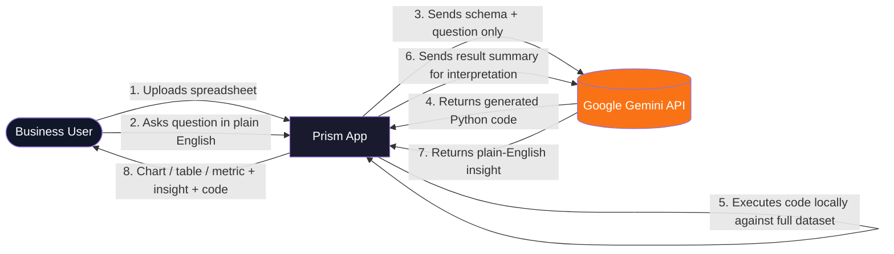
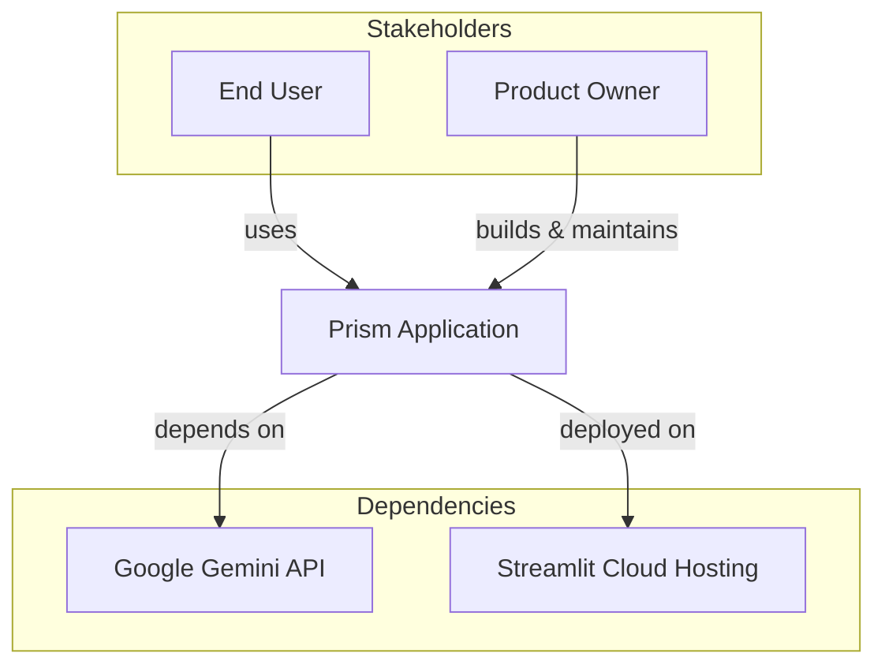
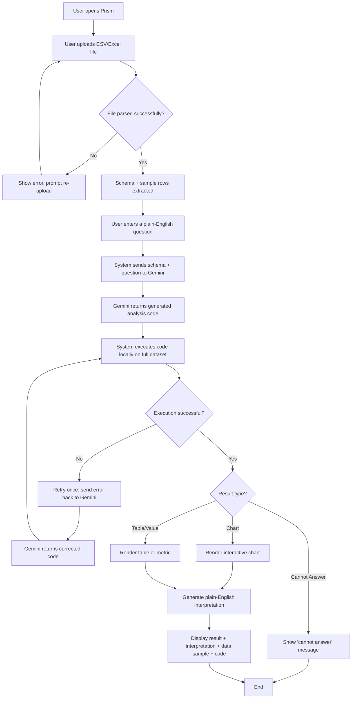

# Business Requirements Document (BRD)

## Prism — Natural Language Data Analyst

<table>
<tr><td><b>Document Type</b></td><td>Business Requirements Document</td></tr>
<tr><td><b>Product</b></td><td>Prism</td></tr>
<tr><td><b>Version</b></td><td>1.0</td></tr>
<tr><td><b>Status</b></td><td>Final</td></tr>
<tr><td><b>Author</b></td><td>Huzaifa Najam</td></tr>
<tr><td><b>Date</b></td><td>2026-07-08</td></tr>
</table>

---

## 1. Document Control

### 1.1 Purpose of this Document

This BRD defines the business problem, objectives, scope, stakeholders, and high-level requirements for Prism, an AI-powered natural language data analysis tool. It is the first of three specification documents for the product:

1. **BRD** (this document) — the business "why"
2. **FSD** (Functional Specification Document) — the "what," from a user/system-behavior perspective
3. **TSD** (Technical Specification Document) — the "how," covering architecture and implementation

### 1.2 Revision History

<table>
<tr><th>Version</th><th>Date</th><th>Author</th><th>Description</th></tr>
<tr><td>1.0</td><td>2026-07-08</td><td>Huzaifa Najam</td><td>Initial draft, finalized</td></tr>
</table>

---

## 2. Executive Summary

Prism is a Streamlit web application that lets a user upload a spreadsheet (CSV or Excel) and ask questions about it in plain English. Instead of writing SQL, pivot tables, or formulas, the user types a question such as *"What would the pie chart of sales by category look like?"* and receives an interactive chart or table, accompanied by a plain-English interpretation of the result.

Under the hood, Prism does not send raw data to a language model. It sends only the dataset's **schema** (column names, types, and a five-row sample) and the user's question to Google Gemini, which responds with executable Python (pandas/Plotly) code. That code is executed locally against the full dataset. This design keeps the product usable on large files, keeps inference costs low and predictable, and avoids exposing full datasets to a third-party API.

Prism targets non-technical or semi-technical users — analysts, small business owners, students, operations staff — who have data but lack the skills (or time) to write analysis code themselves.

---

## 3. Business Context and Problem Statement

### 3.1 Problem Statement

Most spreadsheet data goes underused because extracting insight from it requires skills (SQL, Excel formulas, Python/pandas, BI tooling) that the person holding the data often doesn't have, or doesn't have time to apply. Common existing options each fall short:

<table>
<tr><th>Approach</th><th>Limitation</th></tr>
<tr><td>Manual Excel/pivot tables</td><td>Slow, error-prone, requires formula/pivot expertise</td></tr>
<tr><td>BI tools (Power BI, Tableau)</td><td>Expensive, steep learning curve, overkill for one-off questions</td></tr>
<tr><td>Hiring/asking a data analyst</td><td>Slow turnaround, not scalable for quick ad-hoc questions</td></tr>
<tr><td>General-purpose chatbots (pasting data into ChatGPT)</td><td>Row/column limits, no guarantee of correct computation, privacy concerns from uploading raw data, no repeatable/verifiable code</td></tr>
</table>

There is a gap for a tool that lets anyone ask a plain-English question about their own spreadsheet and get a **correct, verifiable, visual** answer in seconds — without uploading raw data to a third party and without needing to know how to code.

### 3.2 Business Opportunity

Generative AI models are now reliably capable of translating natural language into short, correct data-analysis code. By having the model **write code that runs locally** rather than **reason directly over data**, Prism can:

- Scale to large datasets without hitting model context limits or per-token cost blowups
- Guarantee computations are done by pandas (deterministic, auditable), not "eyeballed" by an LLM
- Let the user inspect and trust the result via the generated code and the underlying data sample
- Minimize data privacy exposure, since only schema + question (never full data) leaves the user's machine

### 3.3 Context Diagram

---

## 4. Business Objectives

<table>
<tr><th style="width:90px">ID</th><th>Objective</th><th>Rationale</th></tr>
<tr><td>BO-1</td><td>Enable non-technical users to self-serve data analysis without writing code</td><td>Removes the single biggest barrier to using spreadsheet data</td></tr>
<tr><td>BO-2</td><td>Return results the user can verify and trust</td><td>Builds trust in AI-generated analysis by exposing the code and data sample, not just a claimed answer</td></tr>
<tr><td>BO-3</td><td>Keep raw data private and local</td><td>Differentiator vs. pasting data into general chat tools; addresses privacy-sensitive users (business, personal, academic data)</td></tr>
<tr><td>BO-4</td><td>Support datasets of meaningful size without cost or context blowups</td><td>Schema-only prompting keeps token usage constant regardless of row count</td></tr>
<tr><td>BO-5</td><td>Deliver an answer in seconds, not hours</td><td>Directly replaces "ask an analyst and wait" or "learn a pivot table" workflows</td></tr>
<tr><td>BO-6</td><td>Operate at low, predictable running cost</td><td>Uses a low-cost Gemini model tier and minimal token volume per question, keeping the product viable as a free/low-cost tool</td></tr>
</table>

---

## 5. Scope

### 5.1 In Scope (Current Product)

- Upload of a single CSV or Excel (`.csv`, `.xlsx`, `.xls`) file per session
- Automatic schema extraction (column names, dtypes, sample rows)
- Natural-language question input
- AI-generated pandas/Plotly code, executed locally
- One automatic retry if generated code fails to execute
- Chart output types: bar, line, pie/donut, histogram
- Tabular and single-value (metric) output types
- Plain-English interpretation of every result
- Display of the underlying data sample used to produce the answer
- Display of the generated code for transparency/verification
- Explicit "cannot answer" flagging when the question is not answerable from the data
- Basic performance metrics shown to the user (codegen time, execution time, retry flag)
- Single-user, single-session interactive web usage (Streamlit)

### 5.2 Out of Scope (Current Product)

- Multi-file or multi-table joins across separate uploads
- Persistent storage of uploaded datasets or query history across sessions
- User authentication, accounts, or multi-tenant access control
- Collaboration features (sharing a session/result with another user)
- Scheduled/recurring analysis or alerting
- Support for data sources other than local CSV/Excel upload (e.g., databases, APIs, cloud storage connectors)
- Editing/refining generated code within the UI
- Natural-language follow-up/conversational refinement of a prior answer
- Export of results (chart/table) to file formats (PDF, PNG, PPTX, etc.)
- Mobile-native application (web-responsive only, via Streamlit)

### 5.3 Future Considerations (Not Committed)

- Conversational follow-up questions that build on a prior result
- Result export (image/PDF/Excel)
- Multi-dataset joins
- User accounts with saved query history
- Support for additional LLM providers/models

---

## 6. Stakeholders

<table>
<tr><th>Stakeholder</th><th>Role / Interest</th></tr>
<tr><td>End User (business user, analyst, student, small business owner)</td><td>Primary consumer; wants fast, trustworthy answers from their own data without writing code</td></tr>
<tr><td>Product Owner / Developer (Huzaifa Najam)</td><td>Owns product direction, build, and deployment</td></tr>
<tr><td>Google Gemini (API provider)</td><td>Supplies the underlying code-generation and interpretation model; a dependency, not a direct stakeholder in outcomes</td></tr>
<tr><td>Streamlit Cloud (hosting)</td><td>Deployment/runtime platform for the public-facing app</td></tr>
</table>

---

## 7. Business Requirements

High-level business requirements that the functional and technical designs must satisfy. Detailed functional behavior is covered in the FSD; implementation detail in the TSD.

<table>
<tr><th style="width:90px">ID</th><th>Requirement</th><th>Priority</th></tr>
<tr><td>BR-1</td><td>The system shall allow a user to upload a spreadsheet file (CSV or Excel) as the data source for analysis</td><td>Must</td></tr>
<tr><td>BR-2</td><td>The system shall allow the user to submit a question about the uploaded data in plain English</td><td>Must</td></tr>
<tr><td>BR-3</td><td>The system shall never transmit the full dataset to an external AI provider — only schema metadata and a small sample</td><td>Must</td></tr>
<tr><td>BR-4</td><td>The system shall return a visual (chart) or tabular/numeric answer appropriate to the nature of the question</td><td>Must</td></tr>
<tr><td>BR-5</td><td>The system shall provide a plain-English interpretation alongside every returned result</td><td>Must</td></tr>
<tr><td>BR-6</td><td>The system shall expose the underlying code and data sample used to generate the answer, for user verification</td><td>Must</td></tr>
<tr><td>BR-7</td><td>The system shall clearly indicate when a question cannot be answered from the available data, rather than fabricating an answer</td><td>Must</td></tr>
<tr><td>BR-8</td><td>The system shall attempt to recover automatically from a failed code-generation attempt before surfacing an error to the user</td><td>Should</td></tr>
<tr><td>BR-9</td><td>The system shall support datasets of substantial size without requiring the full dataset to be sent to the AI model</td><td>Must</td></tr>
<tr><td>BR-10</td><td>The system shall be accessible as a web application requiring no local installation for end users</td><td>Must</td></tr>
<tr><td>BR-11</td><td>The system shall keep per-query operating cost low enough to sustain free or low-cost usage</td><td>Should</td></tr>
</table>

---

## 8. Business Process Flow

---

## 9. Assumptions and Constraints

### 9.1 Assumptions

- Users have a modern web browser and internet access to reach the hosted app and the Gemini API.
- Uploaded files are reasonably well-formed spreadsheets with a header row.
- Users are asking questions that are answerable using standard pandas/Plotly operations (filtering, grouping, aggregation, plotting).
- A single Gemini API key is provisioned and funded by the product owner (or the user's own key, depending on deployment).

### 9.2 Constraints

- Dependent on third-party availability, pricing, and rate limits of the Google Gemini API.
- Code generated by the LLM is executed via `exec()`; correctness and safety rely on prompt constraints restricting the available namespace (`df`, `pd`, `px`, `go` only) rather than sandboxing at the OS/process level.
- Streamlit's single-session, single-user execution model limits concurrency and multi-user collaboration features.
- No persistent database — all state is scoped to the browser session.

---

## 10. Risks

<table>
<tr><th>ID</th><th>Risk</th><th>Impact</th><th>Likelihood</th><th>Mitigation</th></tr>
<tr><td>R-1</td><td>LLM generates incorrect but plausible-looking analysis code</td><td>Medium-High</td><td>Medium</td><td>Expose generated code and data sample so users can verify; retry-on-error logic</td></tr>
<tr><td>R-2</td><td>LLM generates unsafe code (e.g., attempts file/network access)</td><td>High</td><td>Low</td><td>Restricted <code>exec()</code> namespace limits available objects/imports; no imports permitted</td></tr>
<tr><td>R-3</td><td>Gemini API downtime or rate-limiting</td><td>Medium</td><td>Low-Medium</td><td>Surface clear error messaging; no local fallback currently in scope</td></tr>
<tr><td>R-4</td><td>Gemini pricing changes increase per-query cost</td><td>Medium</td><td>Low</td><td>Schema-only prompting keeps token volume low and predictable regardless of price changes</td></tr>
<tr><td>R-5</td><td>User uploads sensitive data expecting full privacy guarantees beyond what's stated</td><td>Medium</td><td>Low</td><td>Clear in-app disclosure that only schema/question is sent externally, never full data</td></tr>
<tr><td>R-6</td><td>Large or malformed spreadsheets cause slow parsing or memory issues</td><td>Medium</td><td>Low-Medium</td><td>Current scope is a known limitation; documented as not fully addressed</td></tr>
</table>

---

## 11. Success Metrics / KPIs

<table>
<tr><th>Metric</th><th>Target / Direction</th></tr>
<tr><td>Question-to-answer success rate (first attempt or after single retry)</td><td>Maximize</td></tr>
<tr><td>Median end-to-end response time (codegen + execution)</td><td>Minimize</td></tr>
<tr><td>Rate of "CANNOT_ANSWER" responses on answerable questions (false negatives)</td><td>Minimize</td></tr>
<tr><td>User trust indicator: rate of users expanding "Generated Code" / "Tabular Sample" panels</td><td>Track as engagement/trust proxy</td></tr>
<tr><td>Cost per question (Gemini API spend)</td><td>Keep below a sustainable per-query threshold</td></tr>
</table>

---

## 12. Glossary

<table>
<tr><th>Term</th><th>Definition</th></tr>
<tr><td><b>Schema</b></td><td>The structural metadata of a dataset: column names, data types, and a small sample of rows — as opposed to the full dataset</td></tr>
<tr><td><b>Codegen</b></td><td>The step where the LLM generates Python analysis code from the schema and question</td></tr>
<tr><td><b>Insight / Interpretation</b></td><td>The plain-English paragraph the system generates to explain a result to a non-technical reader</td></tr>
<tr><td><b>CANNOT_ANSWER</b></td><td>A sentinel result value the generated code returns when the question cannot be answered from the available columns</td></tr>
<tr><td><b>Sample</b></td><td>The intermediate DataFrame (filtered/grouped rows) that produced the final answer, shown to the user for verification</td></tr>
</table>
