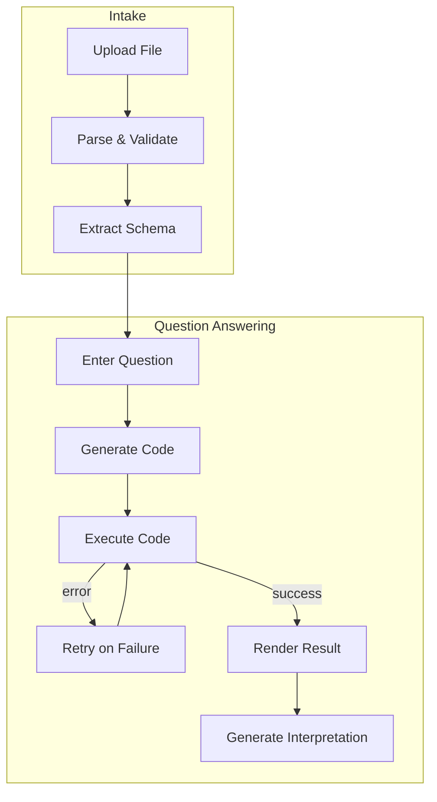
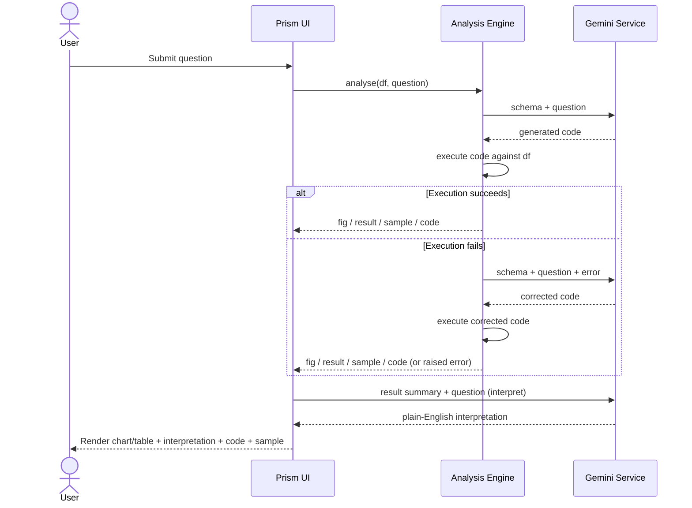
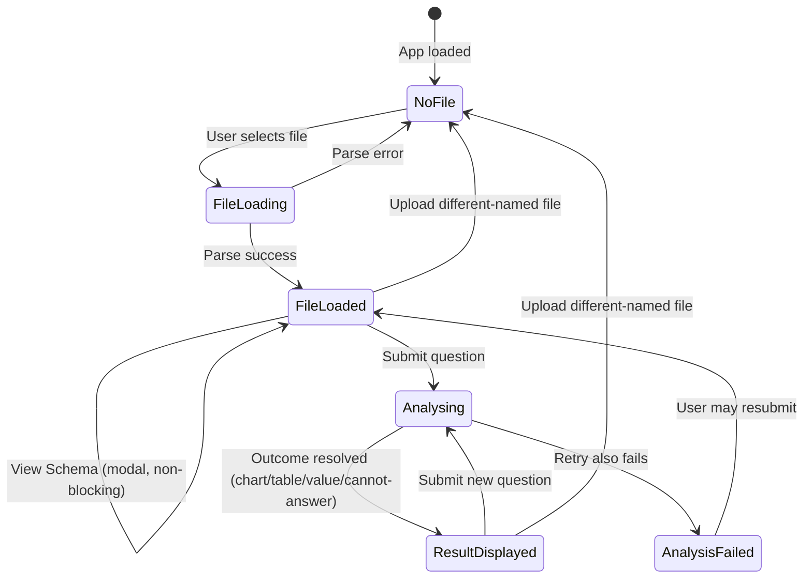

# Functional Specification Document (FSD)

## Prism — Natural Language Data Analyst

<table>
<tr><td><b>Document Type</b></td><td>Functional Specification Document</td></tr>
<tr><td><b>Product</b></td><td>Prism</td></tr>
<tr><td><b>Version</b></td><td>1.0</td></tr>
<tr><td><b>Status</b></td><td>Final</td></tr>
<tr><td><b>Author</b></td><td>Huzaifa Najam</td></tr>
<tr><td><b>Date</b></td><td>2026-07-08</td></tr>
<tr><td><b>Related Documents</b></td><td>BRD.md (business requirements), TSD.md (technical design)</td></tr>
</table>

---

## 1. Document Control

### 1.1 Purpose of this Document

This FSD translates the business requirements in `BRD.md` into concrete, testable functional behavior: what the system does, screen by screen and step by step, from the perspective of a user and of the system's observable behavior. It does not prescribe implementation (covered in `TSD.md`), only **what must happen**.

### 1.2 Revision History

<table>
<tr><th>Version</th><th>Date</th><th>Author</th><th>Description</th></tr>
<tr><td>1.0</td><td>2026-07-08</td><td>Huzaifa Najam</td><td>Initial draft, finalized</td></tr>
</table>

### 1.3 Traceability to BRD

<table>
<tr><th style="width:90px">BRD ID</th><th>Covered By (FSD Section)</th></tr>
<tr><td>BR-1</td><td>4.1 File Upload</td></tr>
<tr><td>BR-2</td><td>4.3 Question Input</td></tr>
<tr><td>BR-3</td><td>4.2 Schema Extraction, 4.4 Analysis Engine</td></tr>
<tr><td>BR-4</td><td>4.5 Result Rendering</td></tr>
<tr><td>BR-5</td><td>4.6 Interpretation</td></tr>
<tr><td>BR-6</td><td>4.5 Result Rendering (Generated Code / Sample panels)</td></tr>
<tr><td>BR-7</td><td>4.4 Analysis Engine (CANNOT_ANSWER path)</td></tr>
<tr><td>BR-8</td><td>4.4.3 Retry Logic</td></tr>
<tr><td>BR-9</td><td>4.2 Schema Extraction</td></tr>
<tr><td>BR-10</td><td>3. Actors and Access, 5. Screen Specifications</td></tr>
<tr><td>BR-11</td><td>4.7 Performance Metrics Display</td></tr>
</table>

---

## 2. Functional Overview

Prism is a single-page, session-scoped web application with two functional halves:

1. **Data intake** — the user uploads a spreadsheet; the system parses it and derives a schema.
2. **Question answering** — the user submits a natural-language question; the system generates analysis code via an LLM, executes it locally, renders the result, and generates a plain-English interpretation.

---

## 3. Actors and Access

<table>
<tr><th>Actor</th><th>Description</th></tr>
<tr><td>End User</td><td>A single, unauthenticated user of the current browser session. No login, no roles, no permission tiers.</td></tr>
<tr><td>Gemini Service</td><td>External system actor. Receives schema + question or result-summary + question; returns generated code or an interpretation string. Not a human actor, but relevant to functional flows below.</td></tr>
</table>

There is no multi-user, multi-role, or admin functionality in this version. Every session is independent and unauthenticated; access to the app equals full access to its functionality.

---

## 4. Functional Requirements by Module

### 4.1 File Upload

<table>
<tr><th style="width:90px">ID</th><th>Requirement</th></tr>
<tr><td>FR-1.1</td><td>The system shall present a file upload control accepting <code>.csv</code>, <code>.xlsx</code>, and <code>.xls</code> file types.</td></tr>
<tr><td>FR-1.2</td><td>Upon selecting a file, the system shall attempt to parse it into a tabular structure (rows and columns).</td></tr>
<tr><td>FR-1.3</td><td>If parsing succeeds, the system shall display a confirmation showing row count and column count (e.g., "1,234 rows · 8 columns loaded").</td></tr>
<tr><td>FR-1.4</td><td>If parsing fails (corrupt file, unsupported structure, wrong extension content), the system shall display an error message describing the failure and shall not proceed to question input.</td></tr>
<tr><td>FR-1.5</td><td>Uploading a new file with a different filename than the currently loaded one shall reset all prior question, result, and interpretation state for that session.</td></tr>
<tr><td>FR-1.6</td><td>The question input control shall remain disabled until a file has been successfully loaded.</td></tr>
</table>

**Behavioral note:** File replacement is name-based — uploading a file with the *same* name as the currently loaded file does not clear prior session state (treated as the same dataset).

### 4.2 Schema Extraction

<table>
<tr><th style="width:90px">ID</th><th>Requirement</th></tr>
<tr><td>FR-2.1</td><td>Upon successful file load, the system shall derive a schema consisting of: each column's name, its inferred data type, and the first 5 rows of data.</td></tr>
<tr><td>FR-2.2</td><td>The schema — not the full dataset — is the only representation of the data that may be transmitted to the external AI service, for both code generation and interpretation requests.</td></tr>
<tr><td>FR-2.3</td><td>The user shall be able to view the full column list and each column's data type on demand via a "View Schema" action, without leaving the main screen (modal/dialog presentation).</td></tr>
</table>

### 4.3 Question Input

<table>
<tr><th style="width:90px">ID</th><th>Requirement</th></tr>
<tr><td>FR-3.1</td><td>The system shall provide a multi-line free-text input for the user's question, with placeholder example text.</td></tr>
<tr><td>FR-3.2</td><td>The system shall provide an "Analyse" action that is disabled unless both a file is loaded and the question field is non-empty.</td></tr>
<tr><td>FR-3.3</td><td>Submitting the question shall trigger the analysis workflow described in 4.4 and shall display an in-progress status indicator ("Analysing your question…") for the duration of code generation and execution.</td></tr>
<tr><td>FR-3.4</td><td>The most recently submitted question, its result, and its interpretation shall persist and continue to be displayed if the user does not submit a new question (e.g., after a page interaction that does not change the question).</td></tr>
</table>

### 4.4 Analysis Engine (Code Generation & Execution)

<table>
<tr><th style="width:90px">ID</th><th>Requirement</th></tr>
<tr><td>FR-4.1</td><td>On question submission, the system shall send the schema (4.2) and the question text to the AI service and request generated Python code that answers the question using a pre-loaded DataFrame.</td></tr>
<tr><td>FR-4.2</td><td>The generated code's execution environment shall expose only the loaded DataFrame and pre-approved data/plotting libraries. No additional imports or objects shall be available to the executed code.</td></tr>
<tr><td>FR-4.3</td><td>The system shall classify the question outcome into exactly one of: <b>Chart</b>, <b>Table/Value</b>, or <b>Cannot Answer</b>, based on what the generated code assigns.</td></tr>
<tr><td>FR-4.4</td><td>For chart-appropriate questions (category comparison, trend over time, distribution, ranking, breakdown, share-of-total), the system shall favor generating a chart over a plain value.</td></tr>
<tr><td>FR-4.5</td><td>For direct single-value questions or explicit list/show requests, the system shall favor a table or scalar result over a chart.</td></tr>
<tr><td>FR-4.6</td><td>If the question cannot be answered from the available schema, the system shall mark the outcome as Cannot Answer rather than returning a fabricated or best-guess result.</td></tr>
<tr><td>FR-4.7</td><td>The system shall capture, alongside the final chart/table/value, an intermediate data sample (up to 10 rows) representing the data that produced the result, for later display.</td></tr>
</table>

#### 4.4.1 Result Classification Rules

<table>
<tr><th>Signal in Question</th><th>Expected Outcome Type</th></tr>
<tr><td>Comparison across categories</td><td>Chart (bar)</td></tr>
<tr><td>Trend over time</td><td>Chart (line)</td></tr>
<tr><td>Distribution of a variable</td><td>Chart (histogram)</td></tr>
<tr><td>Ranking / Top-N</td><td>Chart (bar)</td></tr>
<tr><td>Share of total / proportion</td><td>Chart (pie/donut)</td></tr>
<tr><td>Single count/average/sum with no natural breakdown</td><td>Table/Value (scalar)</td></tr>
<tr><td>Explicit "list"/"show rows" request</td><td>Table/Value (table)</td></tr>
<tr><td>Referenced columns/concepts not present in schema</td><td>Cannot Answer</td></tr>
</table>

#### 4.4.2 Execution Flow

#### 4.4.3 Retry Logic

<table>
<tr><th style="width:90px">ID</th><th>Requirement</th></tr>
<tr><td>FR-4.8</td><td>If the first generated code attempt raises an execution error, the system shall automatically make exactly one further attempt, supplying the original schema, question, and the specific error message back to the AI service.</td></tr>
<tr><td>FR-4.9</td><td>If the second (retry) attempt also fails, the system shall surface a clear error to the user and shall not attempt a third time.</td></tr>
<tr><td>FR-4.10</td><td>The system shall record whether a retry occurred and expose this to the user as part of the performance metrics (4.7).</td></tr>
</table>

### 4.5 Result Rendering

<table>
<tr><th style="width:90px">ID</th><th>Requirement</th></tr>
<tr><td>FR-5.1</td><td>When the outcome is Chart, the system shall render an interactive chart (bar, line, pie/donut, or histogram as generated) with a title and labeled axes.</td></tr>
<tr><td>FR-5.2</td><td>When the outcome is Table/Value and the value is tabular, the system shall render an interactive, scrollable data table.</td></tr>
<tr><td>FR-5.3</td><td>When the outcome is Table/Value and the value is a single scalar, the system shall render it as a labeled metric, using the original question as the label.</td></tr>
<tr><td>FR-5.4</td><td>When the outcome is Cannot Answer, the system shall display a clearly distinguished message stating the question cannot be answered from the available data and suggesting the user rephrase or check column availability.</td></tr>
<tr><td>FR-5.5</td><td>If the generated code produces neither a chart, a result, nor a Cannot Answer marker, the system shall display a message asking the user to rephrase the question.</td></tr>
<tr><td>FR-5.6</td><td>Whenever a non-empty data sample (4.4.7) is available, the system shall make it viewable on demand (collapsed by default) with a caption explaining its purpose (verifying the filter/grouping behind the answer).</td></tr>
<tr><td>FR-5.7</td><td>The system shall make the generated analysis code viewable on demand (collapsed by default) for every non-failed outcome.</td></tr>
</table>

### 4.6 Interpretation

<table>
<tr><th style="width:90px">ID</th><th>Requirement</th></tr>
<tr><td>FR-6.1</td><td>For every outcome that produces a chart or a result (i.e., not Cannot Answer), the system shall request a plain-English interpretation from the AI service, using the question, schema, and a description of the result (including the data sample, where available) as input.</td></tr>
<tr><td>FR-6.2</td><td>The interpretation shall be a single paragraph of 2–4 sentences, written for a non-technical reader, referencing specific values/categories from the result rather than describing the chart mechanically.</td></tr>
<tr><td>FR-6.3</td><td>The interpretation shall be displayed visually distinct from the chart/table (e.g., a highlighted callout box) directly below the rendered result.</td></tr>
<tr><td>FR-6.4</td><td>No interpretation shall be generated or displayed for a Cannot Answer outcome.</td></tr>
</table>

### 4.7 Performance Metrics Display

<table>
<tr><th style="width:90px">ID</th><th>Requirement</th></tr>
<tr><td>FR-7.1</td><td>For every completed analysis, the system shall display: code-generation time, execution time, and total time, each in seconds.</td></tr>
<tr><td>FR-7.2</td><td>If a retry occurred (4.4.3), the metrics display shall indicate this explicitly (e.g., "· retried once").</td></tr>
</table>

### 4.8 Error Handling

<table>
<tr><th style="width:90px">ID</th><th>Requirement</th></tr>
<tr><td>FR-8.1</td><td>If file parsing fails, the system shall show the underlying error reason to the user without crashing the session.</td></tr>
<tr><td>FR-8.2</td><td>If the analysis workflow fails after the single retry (4.4.9), the system shall show an "Analysis failed" message including the underlying error and shall halt further processing for that submission, leaving the UI in a usable state for a new attempt.</td></tr>
<tr><td>FR-8.3</td><td>Errors shall never be silently swallowed — every failure path shall result in a visible message to the user.</td></tr>
</table>

---

## 5. Screen Specifications

### 5.1 Single-Screen Layout

Prism is a single screen split into two regions:

<table>
<tr><th>Region</th><th>Contents</th></tr>
<tr><td>Left panel (input)</td><td>Product title/tagline, file uploader, load confirmation or error, "View Schema" action, question text area, "Analyse" action, in-progress status indicator</td></tr>
<tr><td>Right panel (output)</td><td>Rendered chart or table/metric, plain-English interpretation callout, Cannot-Answer message (if applicable), collapsible "Tabular Sample" panel, collapsible "Generated Code" panel, performance metrics caption</td></tr>
</table>

Before any file is uploaded, the right panel shows neutral placeholder text indicating where results will appear.

### 5.2 Schema Dialog

A modal dialog, triggered by "View Schema," listing every column name paired with its inferred data type. Purely informational; no editing capability.

### 5.3 Screen State Diagram

---

## 6. Business Rules

<table>
<tr><th style="width:90px">ID</th><th>Rule</th></tr>
<tr><td>BRule-1</td><td>The AI service never receives more than the schema (column names, types, 5-row sample) plus the user's question and, on retry, the prior error text — the full dataset is never transmitted.</td></tr>
<tr><td>BRule-2</td><td>A single generated-code attempt may set at most one of a chart output or a scalar/table output — never both.</td></tr>
<tr><td>BRule-3</td><td>Exactly one retry is permitted per question submission; there is no configurable retry count in this version.</td></tr>
<tr><td>BRule-4</td><td>A Cannot Answer outcome suppresses interpretation generation entirely — the system does not attempt to "interpret" a non-answer.</td></tr>
<tr><td>BRule-5</td><td>Switching to a new file (different name) discards the previous question, result, and interpretation from the session.</td></tr>
</table>

---

## 7. Non-Functional Requirements (Functional Impact Only)

<table>
<tr><th style="width:90px">ID</th><th>Requirement</th></tr>
<tr><td>NFR-1</td><td>The status indicator shown during analysis must remain visible and update-free-flicker for the entire duration of codegen + execution + retry (if any), disappearing only once a final outcome or failure is reached.</td></tr>
<tr><td>NFR-2</td><td>The system must remain responsive to a new file upload or question at all times outside of an active analysis run.</td></tr>
<tr><td>NFR-3</td><td>All user-facing text (errors, Cannot Answer messages, metrics) must be in plain English, free of internal implementation detail (e.g., no raw stack traces beyond the essential error message).</td></tr>
</table>

---

## 8. Out-of-Scope Functional Behavior

Per BRD §5.2, the following are explicitly not specified or expected in this version's functional behavior: multi-file joins, saved history across sessions, authentication/roles, collaborative sharing, scheduled runs, non-spreadsheet data sources, in-UI code editing, conversational follow-ups, and result export.

---

## 9. Glossary

<table>
<tr><th>Term</th><th>Definition</th></tr>
<tr><td><b>Outcome</b></td><td>The classification of an analysis result into Chart, Table/Value, or Cannot Answer</td></tr>
<tr><td><b>Session</b></td><td>The lifetime of a single browser tab's interaction with Prism; state does not persist beyond it</td></tr>
<tr><td><b>Sample</b></td><td>Up to 10 rows of intermediate data (filtered/grouped) that produced the displayed result</td></tr>
<tr><td><b>Metrics</b></td><td>The codegen/execution/total timing and retry flag shown after each analysis</td></tr>
</table>
