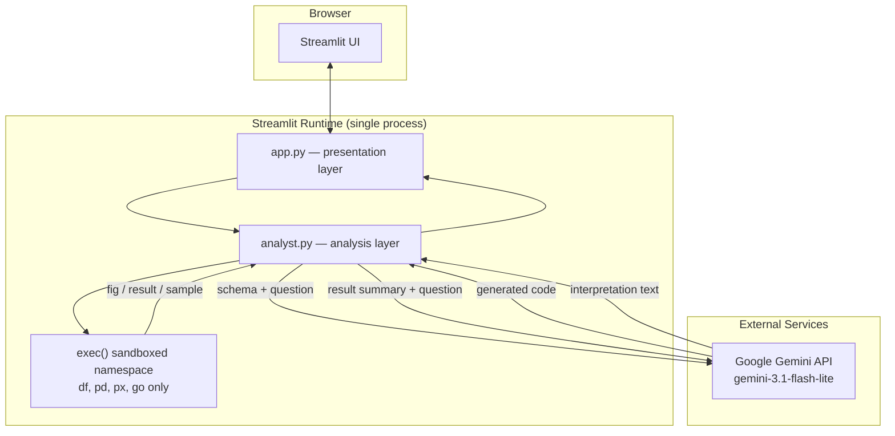
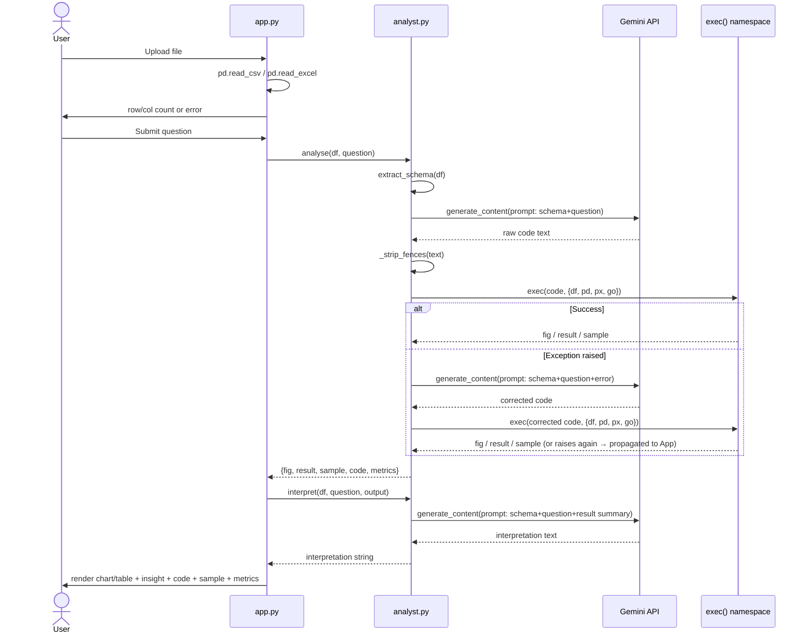
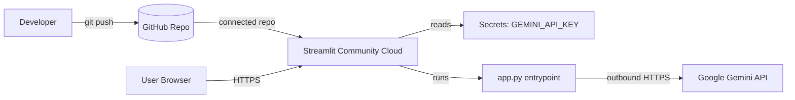

# Technical Specification Document (TSD)

## Prism — Natural Language Data Analyst

<table>
<tr><td><b>Document Type</b></td><td>Technical Specification Document</td></tr>
<tr><td><b>Product</b></td><td>Prism</td></tr>
<tr><td><b>Version</b></td><td>1.0</td></tr>
<tr><td><b>Status</b></td><td>Final</td></tr>
<tr><td><b>Author</b></td><td>Huzaifa Najam</td></tr>
<tr><td><b>Date</b></td><td>2026-07-08</td></tr>
<tr><td><b>Related Documents</b></td><td>BRD.md (business requirements), FSD.md (functional requirements)</td></tr>
</table>

---

## 1. Document Control

### 1.1 Purpose of this Document

This TSD describes how Prism is built: architecture, module responsibilities, data flow, prompt design, execution/security model, deployment, and technical constraints. It implements the behavior specified in `FSD.md`, which in turn satisfies the business requirements in `BRD.md`.

### 1.2 Revision History

<table>
<tr><th>Version</th><th>Date</th><th>Author</th><th>Description</th></tr>
<tr><td>1.0</td><td>2026-07-08</td><td>Huzaifa Najam</td><td>Initial draft, finalized — reflects current implementation</td></tr>
</table>

### 1.3 Traceability to FSD

<table>
<tr><th style="width:110px">FSD Section</th><th>Covered By (TSD Section)</th></tr>
<tr><td>4.1 File Upload</td><td>5.1 UI Layer (app.py)</td></tr>
<tr><td>4.2 Schema Extraction</td><td>5.2 Analysis Layer — <code>extract_schema</code></td></tr>
<tr><td>4.3 Question Input</td><td>5.1 UI Layer (app.py)</td></tr>
<tr><td>4.4 Analysis Engine</td><td>5.2 Analysis Layer — <code>generate_code</code>, <code>run_code</code>, <code>analyse</code></td></tr>
<tr><td>4.5 Result Rendering</td><td>5.1 UI Layer — <code>_render_results</code></td></tr>
<tr><td>4.6 Interpretation</td><td>5.2 Analysis Layer — <code>interpret</code></td></tr>
<tr><td>4.7 Performance Metrics</td><td>5.2.4 Metrics Capture</td></tr>
<tr><td>4.8 Error Handling</td><td>7. Error Handling & Resilience</td></tr>
</table>

---

## 2. Technology Stack

<table>
<tr><th>Layer</th><th>Technology</th><th>Purpose</th></tr>
<tr><td>UI / App shell</td><td>Streamlit</td><td>Renders the single-page app, manages session state, handles file upload widget and layout</td></tr>
<tr><td>LLM provider</td><td>Google Gemini (<code>gemini-3.1-flash-lite</code>) via <code>google-genai</code> SDK</td><td>Code generation and result interpretation</td></tr>
<tr><td>Data handling</td><td>pandas</td><td>Loading CSV/Excel, all data manipulation performed by generated code</td></tr>
<tr><td>Charting</td><td>Plotly Express / Plotly Graph Objects</td><td>Interactive chart rendering, available to generated code as <code>px</code>/<code>go</code></td></tr>
<tr><td>Excel support</td><td>openpyxl</td><td>Backing engine for <code>.xlsx</code>/<code>.xls</code> parsing via pandas</td></tr>
<tr><td>Hosting</td><td>Streamlit Community Cloud</td><td>Public deployment target</td></tr>
<tr><td>Secrets management</td><td>Streamlit <code>secrets.toml</code></td><td>Stores <code>GEMINI_API_KEY</code>, not committed to version control</td></tr>
</table>

---

## 3. System Architecture

### 3.1 High-Level Architecture



### 3.2 Module Boundaries

<table>
<tr><th>Module</th><th>File</th><th>Responsibility</th></tr>
<tr><td>Presentation layer</td><td><code>app.py</code></td><td>Page config, CSS/theming, file upload widget, schema dialog, question form, session-state management, result rendering, status indicators, footer disclosure</td></tr>
<tr><td>Analysis layer</td><td><code>analyst.py</code></td><td>Gemini client initialization, schema extraction, prompt construction, code generation, sandboxed execution, retry orchestration, interpretation generation, metrics capture</td></tr>
</table>

The two modules communicate through a single functional contract: `app.py` calls `analyse(df, question)` and `interpret(df, question, output)` from `analyst.py` and renders whatever dict/string they return. `app.py` never constructs prompts or executes generated code directly.

---

## 4. Data Flow

### 4.1 End-to-End Sequence



### 4.2 Data Sent to External Service

Only the following ever leaves the local process boundary toward Gemini:

<table>
<tr><th>Payload</th><th>Contents</th><th>Sent On</th></tr>
<tr><td>Codegen prompt</td><td>Column names + dtypes, first 5 rows (CSV text), user's question, and (on retry) the prior exception message</td><td>Every analysis submission; retry adds the error</td></tr>
<tr><td>Interpretation prompt</td><td>Same schema block, the question, and a text description of the result (chart flag / scalar value / table head + the data sample)</td><td>Every non-Cannot-Answer outcome</td></tr>
</table>

The full DataFrame is never serialized or transmitted; only `df.head(5)` and, in the interpretation call, `sample.head(10)` (already capped by the generated code) ever appear in a prompt.

---

## 5. Component Design

### 5.1 UI Layer (`app.py`)

<table>
<tr><th>Element</th><th>Implementation Detail</th></tr>
<tr><td>Layout</td><td><code>st.columns([1, 2])</code> — left column for input, right for output, wide page layout</td></tr>
<tr><td>Styling</td><td>Custom CSS injected via <code>st.markdown(..., unsafe_allow_html=True)</code>; dark theme, gradient accents, custom spinner</td></tr>
<tr><td>Session state keys</td><td><code>prism_file</code> (loaded filename), <code>prism_output</code> (last analyse() result dict), <code>prism_question</code>, <code>prism_insight</code></td></tr>
<tr><td>File change detection</td><td>Compares <code>uploaded.name</code> against <code>st.session_state["prism_file"]</code>; on mismatch, pops the three result-related session keys before loading the new file</td></tr>
<tr><td>Schema dialog</td><td><code>@st.dialog("Dataset Schema")</code> decorator function iterating <code>df.columns</code> and printing name + dtype</td></tr>
<tr><td>Status indicator</td><td><code>st.empty()</code> placeholder updated via <code>_show_status(msg)</code>, cleared once processing finishes</td></tr>
<tr><td>Result rendering</td><td><code>_render_results(output, question, insight)</code> — branches on <code>result == "CANNOT_ANSWER"</code>, <code>fig is not None</code>, or scalar/DataFrame <code>result</code></td></tr>
</table>

### 5.2 Analysis Layer (`analyst.py`)

#### 5.2.1 Schema Extraction

```
extract_schema(df) -> str
```
Builds a plain-text block: `"Column names and types:"` followed by `- {col} ({dtype})` per column, then `"First 5 rows (as CSV):"` followed by `df.head(5).to_csv(index=False)`.

#### 5.2.2 Code Generation

```
generate_code(schema, question, error=None) -> str
```
Constructs a single prompt string embedding the schema, the question, and — if present — the previous error appended as a correction hint. Sends it via `client.models.generate_content(model=MODEL, contents=prompt)`. The prompt enforces the rules in FSD §4.4.1 (chart vs. scalar decision, `CANNOT_ANSWER` sentinel, mandatory `sample` variable, no imports, raw-code-only output). The raw response is passed through `_strip_fences()` to remove any Markdown code-fence wrapping (` ```python ... ``` `) via regex.

#### 5.2.3 Sandboxed Execution

```
run_code(code, df) -> dict
```
Executes the generated code string via Python's built-in `exec()` against a namespace dict containing exactly four bindings: `df` (a `.copy()` of the loaded DataFrame — the original is never mutated), `pd`, `px`, `go`. No `__builtins__` restriction is applied beyond what `exec` provides by default; the security boundary is the **prompt contract** (no imports, only these four names), not an OS-level sandbox. See §6 for the associated risk and its accepted mitigation.

After execution, `fig`, `result`, and `sample` are read back out of the namespace via `.get()` (each defaults to `None` if the generated code did not assign it).

#### 5.2.4 Orchestration and Metrics Capture

```
analyse(df, question) -> dict
```
1. Extracts schema once.
2. Times code generation (`t_codegen`).
3. Times execution (`t_exec`); on exception, sets `retried = True`, regenerates code with the error text, and re-executes — a second exception is allowed to propagate uncaught to the caller (`app.py`), which surfaces it as an "Analysis failed" error (FSD FR-8.2).
4. Attaches `code` and a `metrics` dict (`codegen_s`, `exec_s`, `total_s`, `retried`) to the returned output dict.

#### 5.2.5 Interpretation

```
interpret(df, question, output) -> str
```
Builds a result-description string depending on outcome type (chart / scalar / DataFrame), includes the data sample as plain text if present, and sends a second, separate `generate_content` call instructing the model to produce a 2–4 sentence plain-English paragraph. Returns `""` if there is nothing to interpret (no fig and no result — including the Cannot Answer case is naturally excluded because `app.py` only calls `interpret` post-hoc on whatever `analyse` produced, but the *rendering* layer skips calling it visually for Cannot Answer per FSD BRule-4; note the current implementation calls `interpret` regardless, and it self-returns `""` if `output.get("fig")` is falsy and `output.get("result") is None` — a `CANNOT_ANSWER` string result is technically non-None, so this is a known implementation nuance flagged in §9).

---

## 6. Security Considerations

<table>
<tr><th style="width:90px">ID</th><th>Consideration</th><th>Current Mitigation</th></tr>
<tr><td>SEC-1</td><td>Generated code executes via <code>exec()</code> with access to the real interpreter</td><td>Namespace restricted to <code>df</code>, <code>pd</code>, <code>px</code>, <code>go</code>; prompt explicitly forbids imports; no filesystem/network handles are placed in the namespace</td></tr>
<tr><td>SEC-2</td><td>No OS-level sandboxing (no subprocess isolation, no seccomp/container boundary around <code>exec</code>)</td><td>Accepted risk for current scope; relies on prompt-level constraints and the LLM's compliance. Documented in BRD R-2.</td></tr>
<tr><td>SEC-3</td><td>API key exposure</td><td><code>GEMINI_API_KEY</code> stored in <code>.streamlit/secrets.toml</code>, excluded from version control via <code>.gitignore</code>, accessed only through <code>st.secrets</code></td></tr>
<tr><td>SEC-4</td><td>Data privacy</td><td>Only schema (column names/types, 5-row sample) and the up-to-10-row generated <code>sample</code> ever leave the process; full dataset stays local to the running Streamlit process/session</td></tr>
<tr><td>SEC-5</td><td>Prompt injection via crafted column names or data values</td><td>Not currently mitigated; a column name or cell value engineered to alter model instructions could influence codegen. Acceptable given the constrained execution namespace limits blast radius to data-manipulation operations only.</td></tr>
</table>

---

## 7. Error Handling & Resilience

<table>
<tr><th>Failure Point</th><th>Handling</th></tr>
<tr><td>File parsing (<code>pd.read_csv</code> / <code>pd.read_excel</code>)</td><td>Wrapped in <code>try/except</code> in <code>app.py</code>; exception message shown via <code>st.error</code>; <code>df</code> remains <code>None</code>, downstream controls stay disabled</td></tr>
<tr><td>First code execution attempt</td><td>Wrapped in <code>try/except</code> inside <code>analyse()</code>; triggers the single retry path with the error text fed back into <code>generate_code</code></td></tr>
<tr><td>Retry execution attempt</td><td>Not wrapped further — a second failure raises out of <code>analyse()</code> to <code>app.py</code>'s own <code>try/except</code>, which calls <code>st.error(f"Analysis failed: {e}")</code> and <code>st.stop()</code> for that run</td></tr>
<tr><td>Empty/None outcome (no fig, no result, not Cannot Answer)</td><td><code>app.py</code> shows <code>st.warning("The model returned no output. Try rephrasing your question.")</code></td></tr>
</table>

---

## 8. Deployment Architecture



<table>
<tr><th>Aspect</th><th>Detail</th></tr>
<tr><td>Entry point</td><td><code>app.py</code>, run via <code>streamlit run app.py</code></td></tr>
<tr><td>Dependency management</td><td><code>requirements.txt</code>: <code>streamlit</code>, <code>google-genai</code>, <code>pandas</code>, <code>plotly</code>, <code>openpyxl</code></td></tr>
<tr><td>Configuration</td><td><code>.streamlit/config.toml</code> (app/theme config), <code>.streamlit/secrets.toml</code> (API key, not committed)</td></tr>
<tr><td>Process model</td><td>Single Streamlit process per deployment; each browser tab is an independent session sharing the same server-side process and Gemini quota</td></tr>
<tr><td>Scaling</td><td>Not addressed in current architecture — Streamlit Community Cloud's default single-instance behavior applies; no horizontal scaling, load balancing, or queueing layer</td></tr>
</table>

---

## 9. Known Technical Limitations

<table>
<tr><th style="width:90px">ID</th><th>Limitation</th></tr>
<tr><td>TL-1</td><td><code>interpret()</code>'s early-return guard checks <code>output.get("result") is None</code>, but a <code>CANNOT_ANSWER</code> string is non-None — in practice <code>app.py</code> never renders the resulting interpretation for a Cannot Answer outcome, but the interpretation call itself is still made, incurring an avoidable Gemini call and generating text that is simply not displayed.</td></tr>
<tr><td>TL-2</td><td>No hard file-size or row-count ceiling is enforced; extremely large uploads are bounded only by available process memory and pandas' own parsing limits.</td></tr>
<tr><td>TL-3</td><td>No structural validation of the LLM's generated code beyond execution success — a script that executes without error but produces a nonsensical <code>fig</code>/<code>result</code> will still be rendered and interpreted as if correct.</td></tr>
<tr><td>TL-4</td><td>Retry count is hard-coded to exactly one; not configurable without a code change.</td></tr>
<tr><td>TL-5</td><td>Single shared Gemini API key/quota across all concurrent sessions on a given deployment; no per-user rate limiting.</td></tr>
</table>

---

## 10. Glossary

<table>
<tr><th>Term</th><th>Definition</th></tr>
<tr><td><b>Namespace</b></td><td>The Python dict passed to <code>exec()</code> as globals, defining exactly which names the generated code can reference</td></tr>
<tr><td><b>Sentinel value</b></td><td><code>CANNOT_ANSWER</code>, a fixed string used by generated code to signal an unanswerable question rather than raising an exception</td></tr>
<tr><td><b>Session state</b></td><td>Streamlit's per-browser-session key/value store (<code>st.session_state</code>) used to persist the last question/output/insight across reruns</td></tr>
<tr><td><b>Fence stripping</b></td><td>Regex-based removal of Markdown code fences (` ```python ` / ` ``` `) that the LLM may wrap around generated code despite instructions not to</td></tr>
</table>
